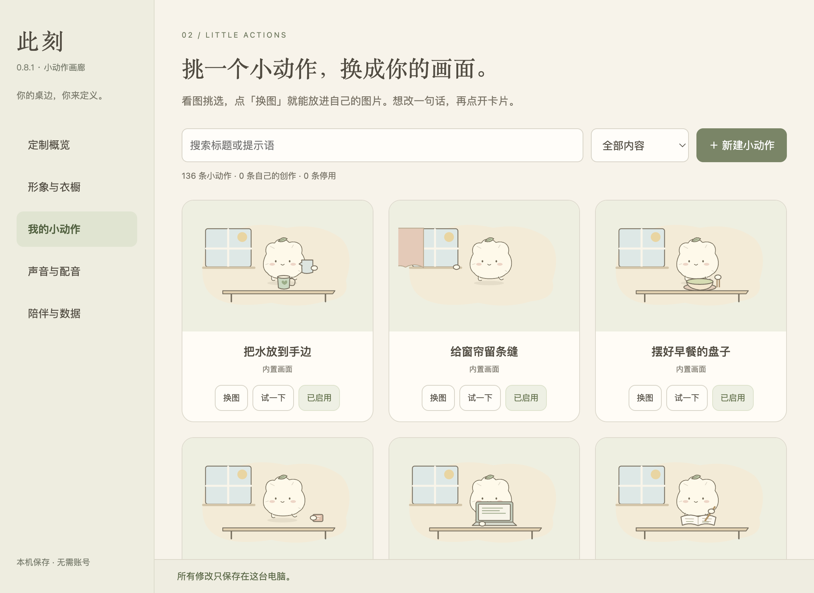
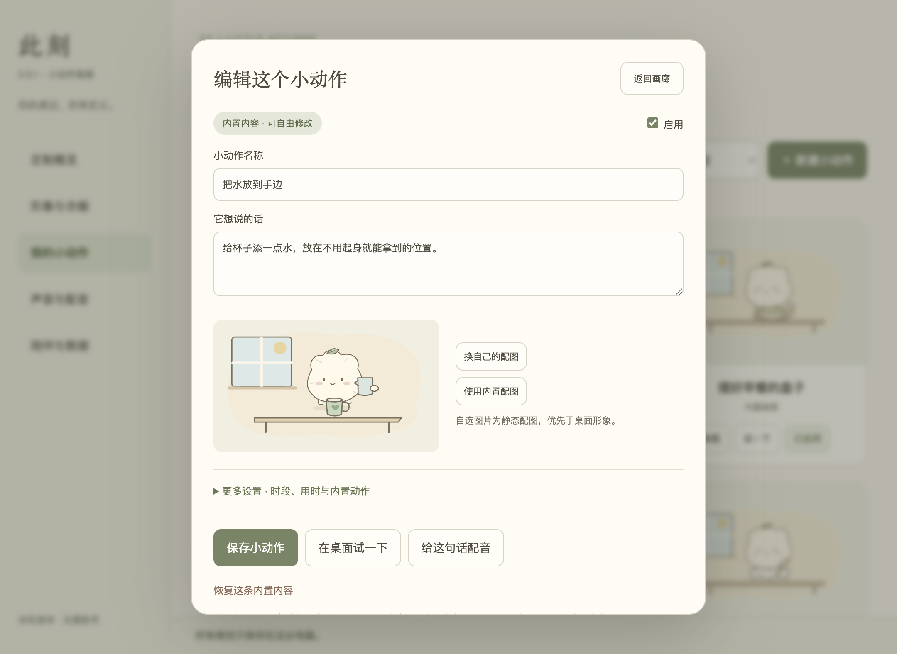
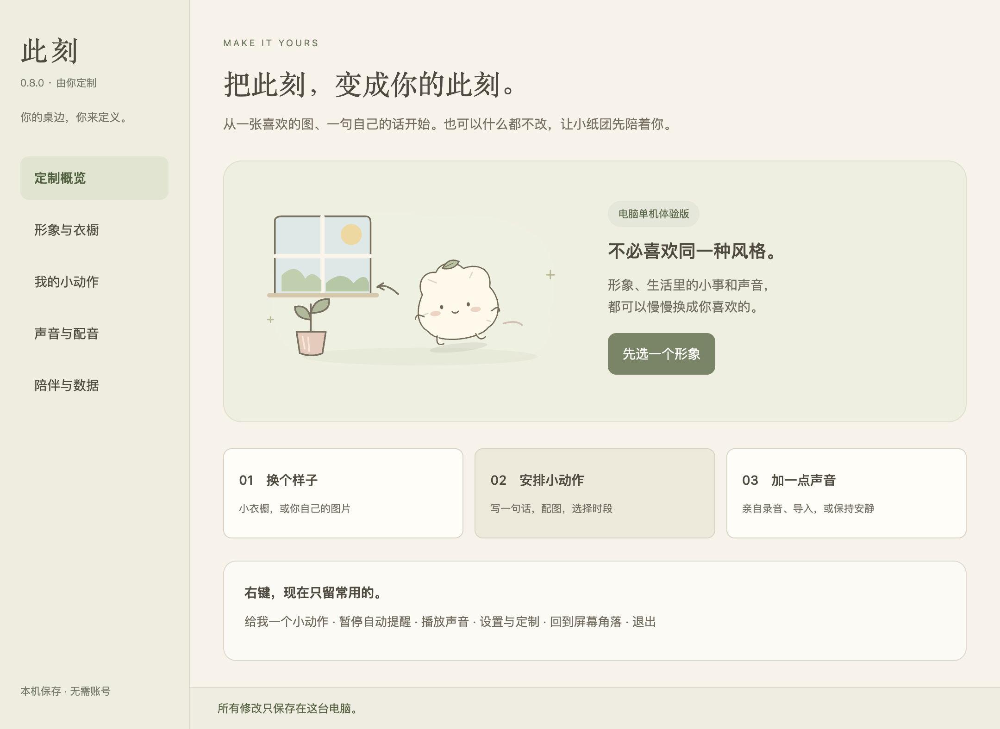
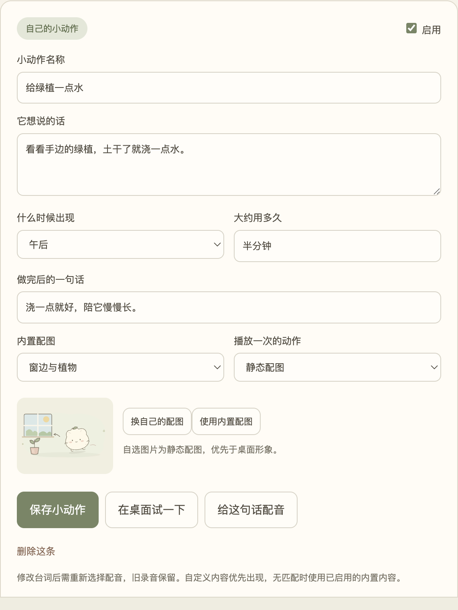
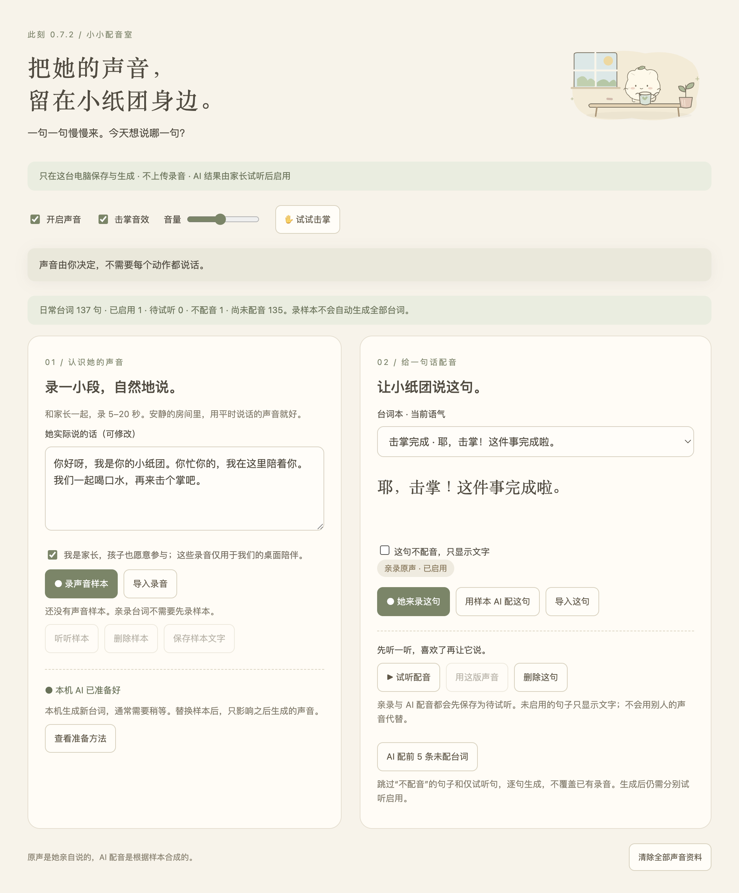
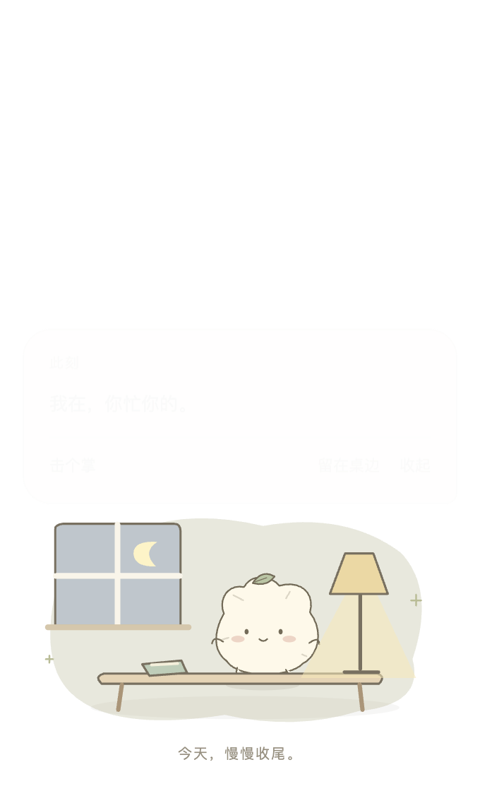
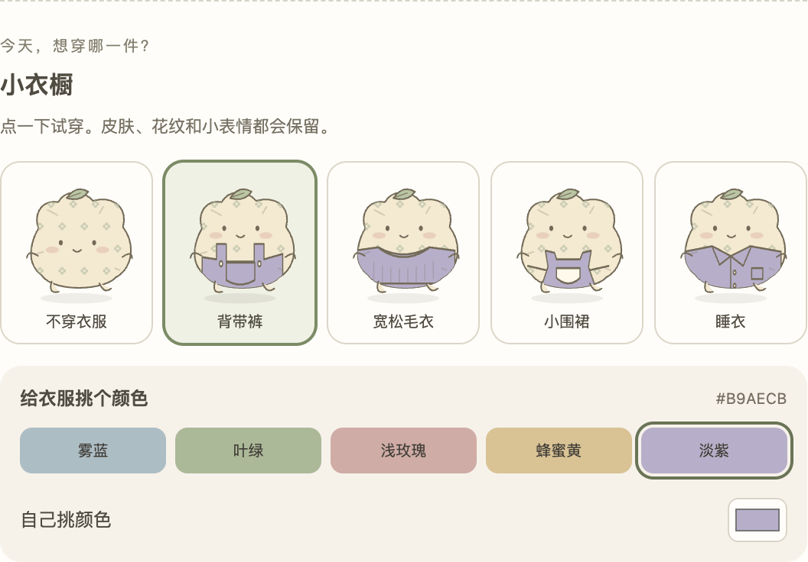
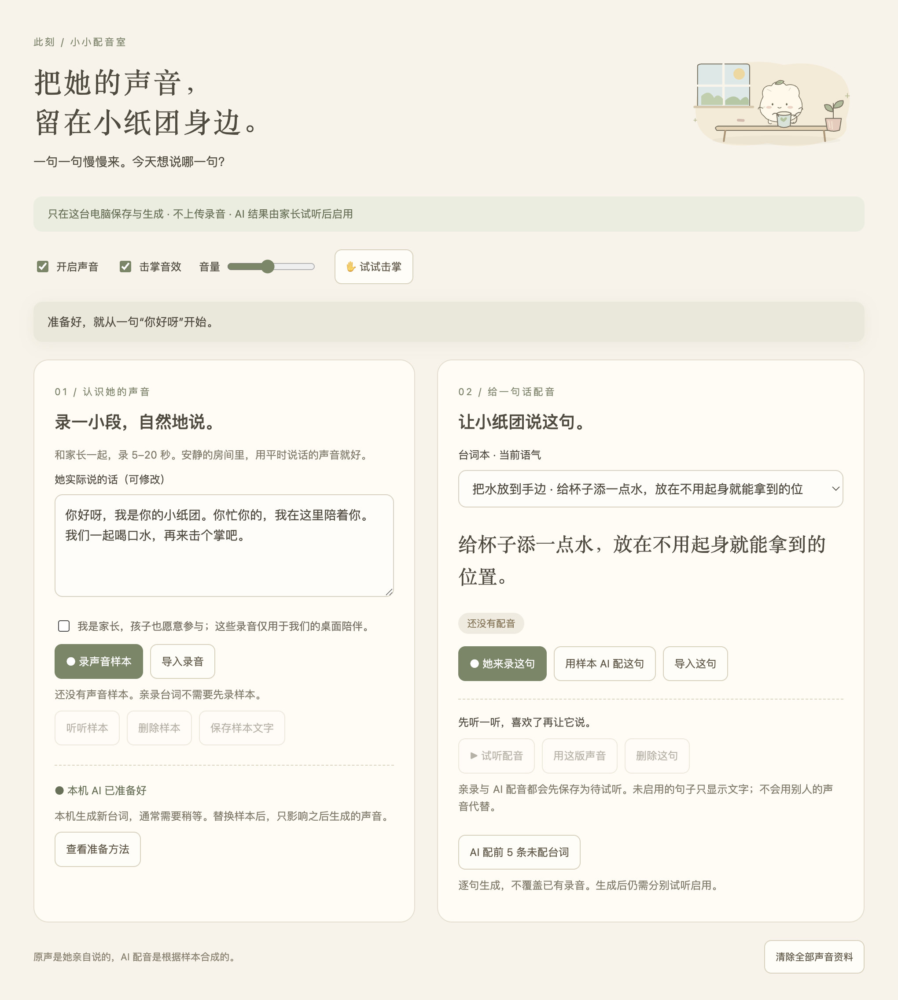
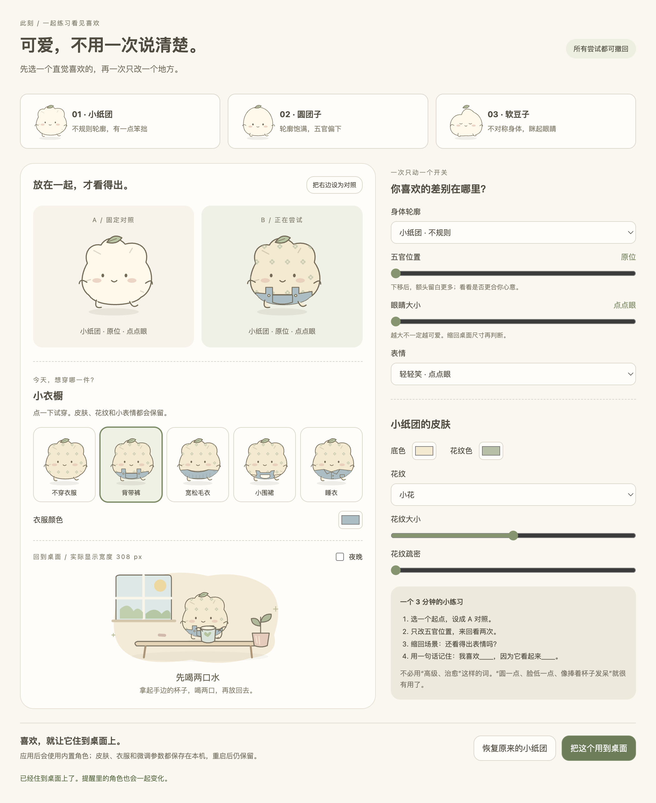

# 可视化版本索引

## 最新开发版：0.8.1 · 小动作画廊
日期2026-09-22；基线0.8.0；待用户评审，无整版认可。未提交、推送或公开发布。

[固定应用](../dist/0.8.1/mac-arm64/此刻.app) · [源码快照](../artifacts/0.8.1/source.tar.gz) · [校验](../artifacts/0.8.1/manifest.json)

图片主导、图下标题、卡片快捷换图/预览/启停、详细设置折叠。48项单测与最终包画廊专项通过，760px及保存重启验证。使用隔离资料与本地测试图片，截图为真实实现。未签名公证，非跨平台正式发行版。

---

## 历史开发版：0.8.0 · 由你定制
日期：2026-09-22；基线0.7.2。待用户评审，最近整版认可版：无。Git未提交，未推送或公开发布。

[固定应用](../dist/0.8.0/mac-arm64/此刻.app) · [使用说明](此刻-0.8.0-使用说明.md) · [源码快照](../artifacts/0.8.0/source.tar.gz) · [校验](../artifacts/0.8.0/manifest.json)

右键六项、统一定制中心、形象预览应用、小动作/时段/配图/逐句配音、配置备份恢复。48项单测及最终包配置、声音、衣橱回归通过。截图为真实最终包和隔离测试资料；无真实AI生成或私人录音试听验收。Mac arm64未签名公证，未跨机器验证；手机配置与任意图片自动生成动作未实现。

---

## 历史开发版：0.7.2 · 声音随你
日期：2026-09-22；基线0.7.1。待用户评审，无整版认可。Git未提交，未推送发布。

[固定应用](../dist/0.7.2/mac-arm64/此刻.app) · [窄屏截图](../artifacts/0.7.2/配音室窄窗口.png) · [源码快照](../artifacts/0.7.2/source.tar.gz) · [校验](../artifacts/0.7.2/manifest.json)

实际最终包截图来自隔离测试资料，不是孩子录音。右键快捷声音开关、逐句不配音、覆盖统计；45项单测及最终包配音与专项回归通过。批量选择验证模拟推理，不代表本轮生成5句真实AI配音；真实资料未改写。未签名公证，本机引擎链接依赖保留。

## 历史开发版：0.7.1 · 击掌与晚安
日期：2026-09-22；基线 wardrobe-v2-20260922。待用户评审；最近整版认可版仍无。Git无提交，未推送发布。

以上来自最终0.7.1应用的实际截图，测试时钟模拟22点；测试声音为合成信号，不是孩子录音。[入口](../dist/0.7.1/mac-arm64/此刻.app)，退出旧版后打开，右键顶部核对版本。开发入口npm start随源码变化。

改动及验证见README与验收记录。45项单测、最终包专项回归通过；真实孩子声音待试听，AI生成本轮未重验。固定源码快照 [source.tar.gz](../artifacts/0.7.1/source.tar.gz)，校验 [manifest.json](../artifacts/0.7.1/manifest.json)，排除录音、模型与私人数据。

## 历史开发版：衣服更大、五官上移 · wardrobe-v2-20260922
日期：2026-09-22；基线0.7.0；Git无提交，所有修改未提交。服装功能已确认，本轮比例与视觉待用户评审。

[完整实际界面](../artifacts/wardrobe-v2-20260922/小衣橱-实际界面.png) · [窄窗口](../artifacts/wardrobe-v2-20260922/小衣橱-窄窗口.png)。来自本轮实际打包应用，不是概念图。

固定入口 `dist/wardrobe-v2-20260922/mac-arm64/此刻.app`，退出旧版后打开→右键→可爱实验室；开发入口 `npm start` 会变化。恢复快照 `artifacts/wardrobe-v2-20260922/source.tar.gz`（不含录音、模型或用户资料）。

改动：衣服扩大、穿衣五官上移、可向上调整、常用色和自选色更明显。45项单测、最终包衣橱回归通过；细节与未验证边界见验收记录。最终IP材质及一键生图未完成；保留同期配音功能，本轮未重新验证AI生成。

## 历史开发版：0.7.0 · 小小配音室
日期：2026-09-22。基线 0.6.1，包含同期小衣橱。评审：待家长与孩子体验；最近整版认可版仍无。名称按用户纠正统一为“小纸团”。

[实际截图原图](../artifacts/0.7.0-小小配音室.png) · [窄窗口](../artifacts/0.7.0-配音室窄窗口.png) · [说明](小小配音室.md)

固定入口：`dist/0.7.0/mac-arm64/此刻.app`；退出旧版后打开，右键 → 小小配音室。开发入口 `npm start` 随源码更新。已验证此固定包能找到旁边链接的本机引擎，能真实离线生成；引擎不包含在 `.app` 内，不适合单独复制分发。

已实现：录样本、亲录/导入、样本文字修正、AI 单句/五句批量、试听启用、卡片配音、击掌声、音量/静音与删除。44项单测及最终包回归、真实推理通过，具体见验收记录。

Git 未提交，未推送、未发布。恢复快照：`artifacts/cike-0.7.0-source.tar.gz`；src与包对应的校验：`artifacts/0.7.0-source-manifest.json`。模型和个人声音不入快照，安装通过固定依赖清单和模型版本复现。

未验证女儿真实声音相似度和真实麦克风硬件；测试音频明确标为“非女儿声音”。技术通过不等于孩子/家长的声音或界面认可。

## 同期独立版本：小衣橱与皮肤 · wardrobe-20260922
日期：2026-09-22。package 0.7.0；基于现有工作区继续，保留同期配音开发。功能方案已确认，具体服装视觉待评审；最近整版认可版本仍无。

以上为真实打包应用截图，不是概念图。[界面原图](../artifacts/wardrobe-20260922/小衣橱-实际界面.png) · [窄窗口](../artifacts/wardrobe-20260922/小衣橱-窄窗口.png)。

固定入口：`dist/wardrobe-20260922/mac-arm64/此刻.app`，退出旧应用后打开，右键→可爱实验室。`npm start` 为随开发变化入口。Git 无提交；源码快照 `artifacts/wardrobe-20260922/source.tar.gz`，排除用户资料、参考照片、依赖。固定应用包为本轮测试产物。

新增四件衣服和无衣服选择、衣服色、皮肤底色与花纹，预览/应用/重启保留/恢复；42项单测及开发态/打包态衣橱验收通过，详见验收记录。最终 IP 材质与一键AI场景生成未实现；配音能力不在本轮声明的验收范围内。无提交、推送、发布。

## 历史版本：0.6.1 · 安静时收起击掌入口
日期：2026-09-22；基线 0.6.0。待用户评审，未提交（仓库无提交）。

真实应用截图。固定入口：`dist/0.6.1/mac-arm64/此刻.app`；退出旧版后打开。开发入口 `npm start` 随源码变化。恢复快照：`artifacts/cike-0.6.1-source.tar.gz`。
仅举手等待时显示点击区，击中立即隐藏，完成表情 2.6 秒后收回；15 秒未回应也收回。验证见验收记录；其他边界继承 0.6.0。

## 历史版本：0.6.0 · 击掌与安静陪伴
日期：2026-09-22。基线：0.5.0。评审：待用户评审；尚无整版最终认可记录。

以上为本轮真实 Electron 页面截图，非概念图。原图可点击查看。
固定应用入口：`dist/0.6.0/mac-arm64/此刻.app`；启动前退出旧版。
开发入口：项目目录 `npm start`（会随修改更新）。
Git：仓库尚无提交，全部文件未提交；恢复快照 `artifacts/cike-0.6.0-source.tar.gz`，包含 src、assets、scripts、test、package 文件及项目文档，不含用户资料、依赖或参考照片。

改动：两阶段击掌、安静静态变化、过时饭点筛选与预览标记。验证和限制见[验收记录](验收记录.md)。
没有真人手势识别；用户图片不自动生成姿态；没有引入计数、联网生成或系统通知。

## 历史基线
0.5.0 具体动作版入口 `dist/0.5.0/mac-arm64/此刻.app`；历史截图与验证见验收记录。
最近认可版：尚无整版最终认可；纸感/羊毛毡仅获允许探索。
